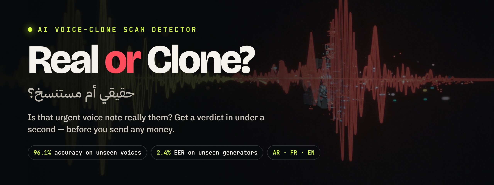
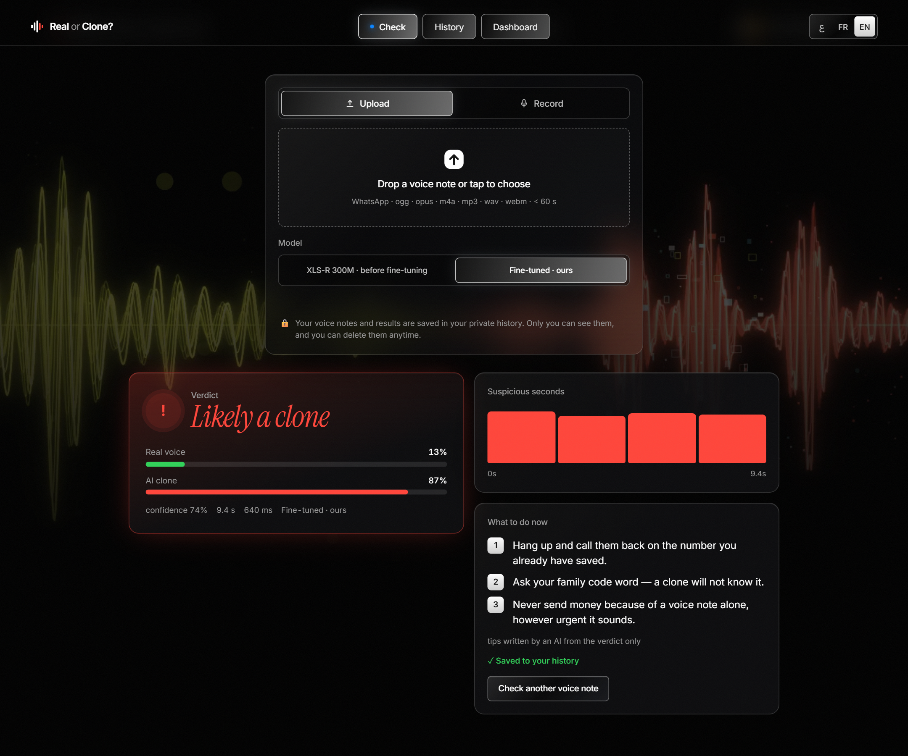
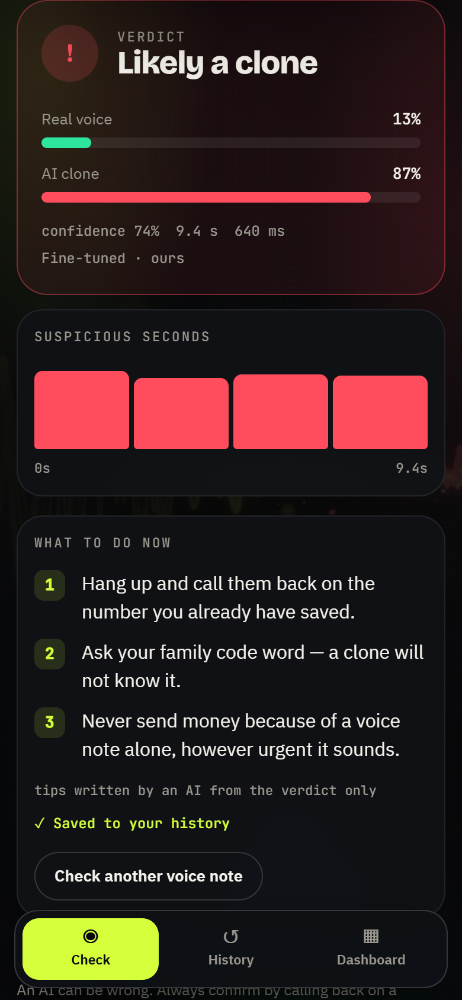
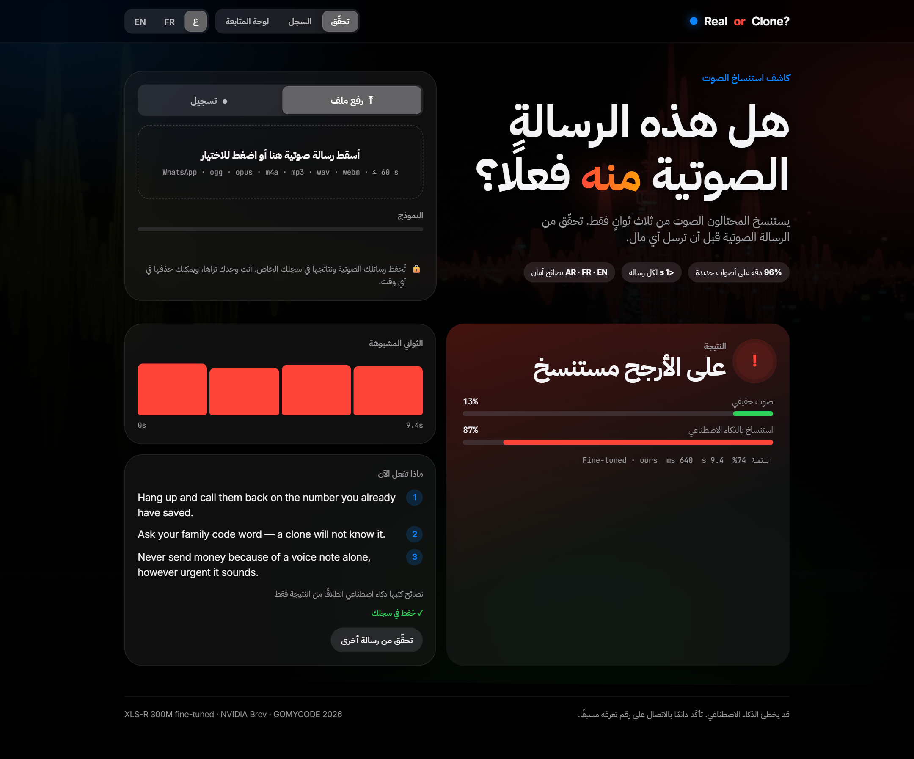
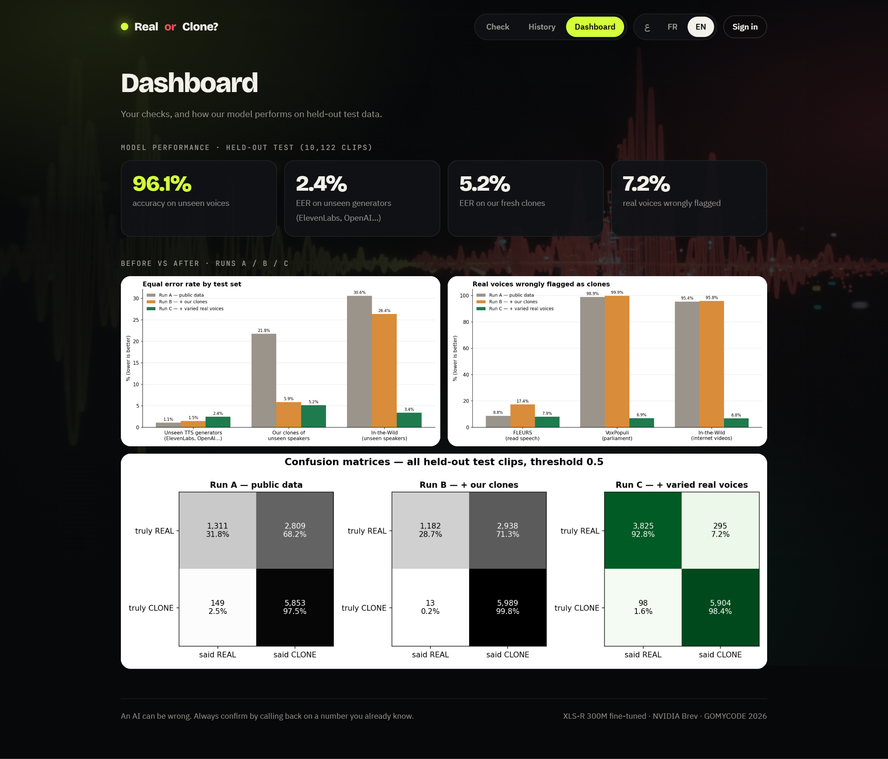
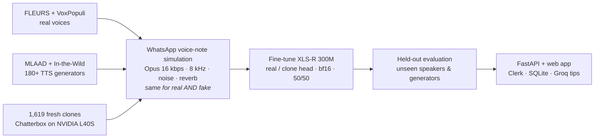
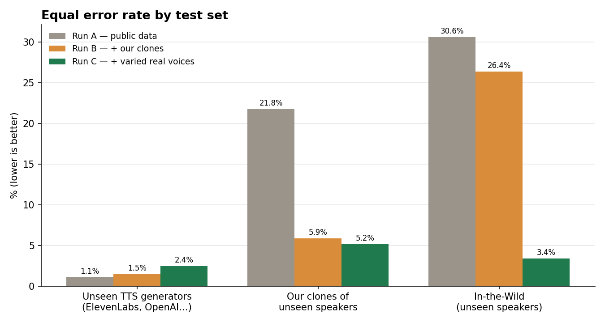
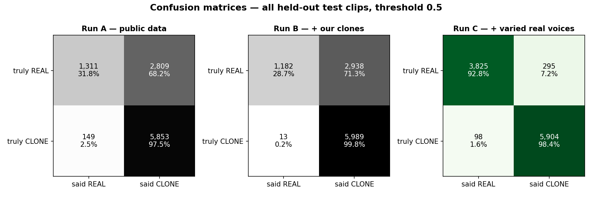
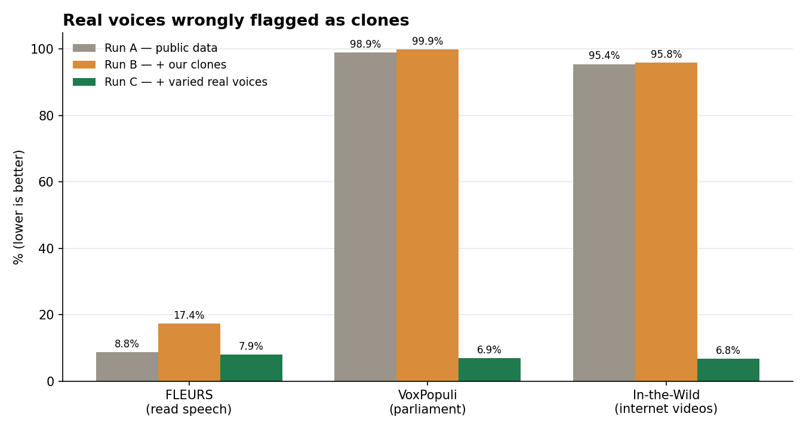

<p align="center">
  
</p>

<p align="center">
  <a href="https://real-or-clone-9m7lxdq0i.gobrev.dev"></a>
  <a href="https://real-or-clone-9m7lxdq0i.gobrev.dev/demo.mp4"></a>
  <a href="https://github.com/ilyasdaoudrma/real-or-clone/raw/main/docs/Real-or-Clone.pptx"></a>
</p>

<p align="center">
  
  
  
  
  
  
  <a href="LICENSE"></a>
</p>

<p align="center"><b>Scammers need 3 seconds of audio to clone a voice.</b><br>
Real or Clone? checks a WhatsApp voice note in under a second and tells you — in Arabic, French or English — whether it is really them.</p>

---

## The problem

> *“Mom, I had an accident. Send money now.”* — sent as a voice note, in your son's voice. Except it isn't him.

| **3 s** | **1 in 4** | **70%** |
|:---:|:---:|:---:|
| of audio is enough to clone a voice | adults faced an AI voice scam or know a victim | can't tell a clone from a real voice |

<sub>Source: McAfee survey of 7,054 adults in 7 countries — 77% of victims lost money.</sub>

## The product

<table>
  <tr>
    <td width="62%"></td>
    <td width="38%"></td>
  </tr>
</table>

- **Verdict** — likely real · likely clone · uncertain, with confidence and real-vs-clone probabilities
- **Suspicious seconds** — a timeline of 4-second windows so you can hear *where* it sounds synthetic
- **3 safety tips** in AR / FR / EN, written by an LLM **from the verdict only** — it never hears the audio and can't change the verdict
- **Before / after switch** — run the same note through XLS-R *before* fine-tuning (a coin flip) and through our model
- **Private history & dashboard** — Clerk login; each check (audio + result) is visible only to you and deletable
- **Mobile-first** — bottom tab bar, right-to-left Arabic, record straight from the phone

<table>
  <tr>
    <td></td>
    <td></td>
  </tr>
</table>

## How it works



Everything — clone generation, three fine-tunes and evaluation — ran on **one NVIDIA L40S on Brev** for about **$10**.

## Results

All three runs are scored on the **same held-out test set: 10,122 clips from speakers and generators never seen in training.**

| Test set | Run A · public data | Run B · + our clones | **Run C · + varied real voices** |
|---|:---:|:---:|:---:|
| Unseen generators (ElevenLabs, OpenAI, Gemini…) — EER | 1.1% | 1.5% | **2.4%** |
| Our clones of unseen speakers — EER | 21.8% | 5.9% | **5.2%** |
| In-the-Wild, unseen speakers — EER | 30.6% | 26.4% | **3.4%** |
| Real voices wrongly flagged | 68.2% | 71.3% | **7.2%** |
| Accuracy (all test clips) | 70.8% | 70.8% | **96.1%** |
| Latency per 10 s of audio | 35 ms | 46 ms | **30 ms** |

<p align="center"></p>

**Fresh clones cut the error on cloned voices 4×** (run A → B). Then our own test caught a shortcut:

> **Run A learned “sounds like FLEURS = real, anything else = fake”.** It flagged 96–99% of real voices from other sources — including the team lead's own phone voice note (p_fake = 1.00). Adding varied real voices (run C) removed it: false alarms fell to **~7%** and the same note scored **0.17 (real)**.

<details>
<summary><b>Confusion matrices & false-alarm chart</b></summary>
<br>


</details>

Full numbers, method and AI disclosure: [`SUBMISSION.md`](SUBMISSION.md).

## Try it

1. Open **[real-or-clone-9m7lxdq0i.gobrev.dev](https://real-or-clone-9m7lxdq0i.gobrev.dev)** and sign in (Google or email).
2. **Upload** a voice note (WhatsApp ogg/opus, m4a, mp3, wav · 1–60 s) or **Record** one.
3. Read the verdict, the suspicious seconds and the tips; switch **ع / FR / EN**.
4. Switch **Model** to *XLS-R 300M · before fine-tuning* and upload the same note — that is what fine-tuning adds.
5. **History** to replay or delete your checks, **Dashboard** for your stats and our results.

## Reproduce it

<details>
<summary><b>Full pipeline on a GPU box (Brev, Ubuntu)</b></summary>

```bash
git clone https://github.com/ilyasdaoudrma/real-or-clone && cd real-or-clone
sudo apt-get install -y ffmpeg
python3 -m venv ~/venv-main && source ~/venv-main/bin/activate && pip install -r requirements.txt
cp .env.example .env                                   # HF_TOKEN (MLAAD is gated), LLM + Clerk keys

python data/download.py                                # FLEURS, In-the-Wild, MLAAD FR/EN, VoxPopuli
python3 -m venv ~/venv-tts && ~/venv-tts/bin/pip install chatterbox-tts "setuptools<81"
for i in 0 1 2 3 4 5; do ~/venv-tts/bin/python generate/clone.py --n 500 --shard $i --num-shards 6 & done

python data/build_manifest.py                          # speaker- and generator-disjoint splits
python augment/voicenote.py                            # voice-note simulation, real AND fake
python -m train.train --run c --epochs 2               # also: --run a, --run b
python -m eval.evaluate --run c                        # EER, false alarms, per-generator detection

CKPT=checkpoints/run_c uvicorn api.main:app --host 0.0.0.0 --port 8000
```
</details>

| Folder | What's inside |
|---|---|
| [`data/`](data) | dataset download, train/test manifest with held-out speakers and generators |
| [`generate/`](generate) | Chatterbox clone generation (sharded) and the consented demo clone |
| [`augment/`](augment) | WhatsApp-style voice-note simulation applied to real and fake alike |
| [`train/`](train) | XLS-R 300M fine-tuning and the shared windowed detector |
| [`eval/`](eval) | held-out evaluation: EER, AUC, false alarms, per-generator detection |
| [`api/`](api) | FastAPI: analysis, Clerk auth, per-user history, rate limits & quotas |
| [`web/`](web) | the mobile-first single-page app (EN / FR / AR) |
| [`docs/`](docs) | figures, screenshots, slides and the scripts that build them |

## Responsible AI

- **Privacy** — login required; each user's audio and results are private and deletable item by item.
- **LLM scope** — the LLM never hears the audio and cannot change the verdict; fixed expert tips if it fails.
- **Consent** — the demo clone is the team lead's own voice, with written consent.
- **Humility** — the app never says “certain” and always tells you to call back on a number you know.
- **Security** — two audit passes: same-origin API, auth before upload, per-user & global rate limits, storage quotas, CSP.
- **Limits** — trained and tested on English and French only; not validated on Arabic or Darija voices yet. MLAAD is CC-BY-NC, so this is a non-commercial prototype.

## Built with

| | Source | Licence | Role |
|---|---|---|---|
| XLS-R 300M | [`facebook/wav2vec2-xls-r-300m`](https://huggingface.co/facebook/wav2vec2-xls-r-300m) | Apache-2.0 | detector backbone, fine-tuned by us |
| Chatterbox Multilingual | [`ResembleAI/chatterbox`](https://huggingface.co/ResembleAI/chatterbox) | MIT | fresh clones + demo clone |
| gpt-oss-120b | Groq API | Apache-2.0 | safety tips from the verdict JSON |
| FLEURS | [`google/fleurs`](https://huggingface.co/datasets/google/fleurs) | CC-BY-4.0 | real speech (EN, FR) |
| VoxPopuli | [`facebook/voxpopuli`](https://huggingface.co/datasets/facebook/voxpopuli) | CC0 | varied real speech |
| MLAAD | [`mueller91/MLAAD`](https://huggingface.co/datasets/mueller91/MLAAD) | CC-BY-NC-4.0 | fake speech, 180+ generators |
| In-the-Wild | [`mueller91/In-The-Wild`](https://huggingface.co/datasets/mueller91/In-The-Wild) | CC-BY-SA-4.0 | real + fake, speaker-split |
| NVIDIA Brev | L40S 48 GB | — | generation, training, evaluation, serving |
| Clerk · SQLite · FastAPI · Motion | — | — | auth, history, API, animations |

Code written with **Claude Code**; the team chose the approach, ran every GPU step, listened to the clones, checked the numbers and caught the shortcut. Background art generated with Higgsfield; video voiceover with ElevenLabs.

## License

The **code** in this repository is released under the [MIT License](LICENSE).
Models and datasets keep their own licences (see *Built with*). Because MLAAD is CC-BY-NC-4.0, **the trained detector weights are for non-commercial use only**; they are not included in this repository.

## Team

**Ilyas Daoud** (lead, ML) · **Oualid Karmoun** (data, testing) · **Ayoub El Mouhib** (web app)

Built in one day at **GOMYCODE × NVIDIA — Come Build with AI**, Morocco, 27 September 2026.
